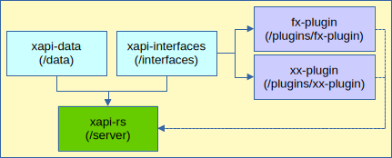

> _I wrote this document as a reminder to myself of what needs to be done when 
publishing some or all of the packages in this workspace. Hopefully it will also 
be useful to others using this software or planing to contribute to it._


## Assumptions, abbreviation & aliases

In the rest of this document, i'll be using...

- **`c`** as an alias to `cargo`; i.e. have `alias c='cargo'` in `~/.bashrc`,
- `cargo` aliases; i.e.
  - `b` for `build`,
  - `c` for `check`,
  - `t` for `test`,
  - `d` for `doc`, and
  - `r` for `run`.

Also the commands assume that `cargo-semver-checks`, and `sqlx-cli` are already
installed. Verify by doing `c install --list ↵` and check the output. If they're
not listed install them doing `c install semver-checks ↵` for the first, and
`c install sqlx-cli ↵` for the second.


## Dependency graph

The ultimate deliverable is an [xAPI](https://opensource.ieee.org/xapi/) version
2.0 [Learning Record Store (LRS)](https://en.wikipedia.org/wiki/Learning_Record_Store)
HTTP Server, nicknamed **LaRS**, published to `crates.io` as `xapi-rs`. It lives
in the `/server` folder.

The next diagram illustrates the dependencies between the various members of
this workspace.


<br/>Fig-1: Workspace dependency graph.

A crate, published independently as `xapi-data`, living in the `/data` folder,
is a dependency of `xapi-rs`. It contains Rust bindings for xAPI data types and 
is aimed at Rust developers working w/ xAPI whether they use **LaRS** or not as 
part of their solutions.

Another recently added dependency, independently published as well, is
`xapi-interfaces`, living in `/interfaces`. It defines _Traits_ that _Plugins_
will implement. It is a dependency to `xapi-rs` as well as to both WASM projects
included in the `/plugins` folder: `fx-plugin` and `xx-plugin`. _xAPI Plugins_
are effectively implemented and distributed as _WASM WASI Preview 1_ binaries.

Plugins are not published to `crates.io`. Their binaries are included in the
`xapi-rs` distribution, but their source files reside in GitHub w/in this project
under the aforementioned folders. A Bash script `build-plugins.sh` ensures the 
WASM binaries are generated and copied to `/server/plugins` folder.
That privileged location is used by **LaRS** to find the needed plugins at runtime.
An `include = ["/plugins"]` [field](https://doc.rust-lang.org/cargo/reference/manifest.html#the-exclude-and-include-fields) in `/server/Cargo.toml` ensures
that the sub-folder in question and its contents are included in the crate when
packaged + published to `crates.io`.

This explanation should hopefully help clarify the impact of any change to every
component in this chain, and make it obvious the sequence of events involved in
the publishing process.


## Before publishing any crate

Make sure affected crates, where referenced, are specified as `path` dependencies
not w/ fixed versions. For example, when working on `xapi-interfaces`, then in
`/server/Cargo.toml` use...

```toml
xapi-interfaces = { path = "../interfaces" }
# xapi-interfaces = "0.1.0"
```

After working on one or more members of this workspace and before publishing
any crate, starting at the root of the project do...

1.  `c upgrade ↵`
2.  `c update -v ↵`
3.  update `Cargo.toml` bumping dependencies to latest versions if needed.
4.  `c b -r --workspace ↵`
5.  `c clippy --workspace ↵`
6.  `./build-plugins.sh ↵`
7.  `c t --workspace ↵`
8. `c d --no-deps --workspace ↵`
9. review generated docs in `target/doc`.

## When publishing `xapi-data` or `xapi-interfaces`

As mentioned earlier, make sure the crate is referenced by other crates using a
`path` dependency, not a fixed version. This is to ensure that changes made are
used and tested properly. For example, for `xapi-data`, in `/server/Cargo.toml`
use...

```toml
xapi-data = { path = "../data" }
# xapi-data = "1.0.0-rc.1"
```

Assuming we're publishing `xapi-data` as version `1.0.0`...

1.  update `/data/Cargo.toml`. Set `version` in [package] section to `1.0.0`.
2.  `c semver-checks -p xapi-data ↵` (skip if first release).
3.  `c c -p xapi-data ↵`

4.  `git commit -m "data: bump to 1.0.0" ↵`
5.  `git tag data-1.0.0 ↵`

6.  `c publish -p xapi-data --dry-run ↵`
7.  `c publish -p xapi-data ↵`

8.  `c search xapi-data --limit 1 ↵` + check the result.

9.  update `server/Cargo.toml`. Change `xapi-data` dependency from `{path="../data"}` to `"1.0.0"`.
10. `c update -v ↵`
11. `c check -p xapi-rs ↵`

## When publishing `xapi-rs`

Say new version is 0.3.0.

 1. update _`version`_ in `/server/Cargo.toml` under _`[package]`_ section to `0.3.0`.
 2. ensure `Cargo.toml` references `xapi-data` and `xapi-interfaces` by latest
    published versions; ie.
```toml
  # xapi-data = { path = "../data" }
  xapi-data = "1.0.0"
  # xapi-interfaces = { path = "../interfaces" }
  xapi-interfaces = "0.1.0"
```
 3. run the steps listed in the _Before publishing any crate_ section.
 4. ensure latest conformance tests (continue to) pass.
 5. `c semver-checks -p xapi-rs ↵`
 6. `c c -p xapi-rs ↵`
 7. `git commit -m "server: bump to 0.3.0" ↵`
 8. `git tag server-0.3.0 ↵`
 9. `c publish -p xapi-rs --dry-run ↵`
10. `c publish -p xapi-rs ↵`

11. `c update -v ↵`
12. `git push origin main ↵`
13. `git push origin data-1.0.0 interfaces-0.1.0 server-0.3.0 ↵`
