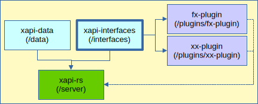

# xapi-interfaces

This Package is part of a Cargo Workspace whose ultimate deliverable is **LaRS** &mdash;a version 2.0 [xAPI](https://opensource.ieee.org/xapi/) [Learning Record Store (LRS)](https://en.wikipedia.org/wiki/Learning_Record_Store) HTTP Server, published as [`xapi-rs`](https://crates.io/crates/xapi-rs).

_**LaRS**_ makes use of _Plugins_ implementing _Interfaces_ defined here, as Rust _Traits_.  _Plugins_ are packaged as [WASM](https://en.wikipedia.org/wiki/WebAssembly) WASI Preview 1 Modules. They are not published to `crates.io` but are bundled w/ [`xapi-rs`](https://crates.io/crates/xapi-rs).

The next diagram illustrates the role this package plays in the xAPI LRS (`xapi-rs`) project.

 Fig-1: Workspace dependency graph.

Changes are tracked in [ChangeLog](CHANGELOG.md).

## `Hashing` interface
So far only one _Trait_ is defined: _Hashing_. _Plugins_ implementing this _Interface_ are used by **LaRS** Authentication Policies to enforce a policy, or allow continuous operation when migrating from one policy to another.

## License

This program is free software: you can redistribute it and/or modify it under the terms of the GNU General Public License as published by the Free Software Foundation, either version 3 of the License, or (at your option) any later version.

This program is distributed in the hope that it will be useful, but WITHOUT ANY WARRANTY; without even the implied warranty of MERCHANTABILITY or FITNESS FOR A PARTICULAR PURPOSE. See the GNU General Public License for more details.

You should have received a copy of the GNU General Public License along with this program. If not, see <https://www.gnu.org/licenses/>. 
